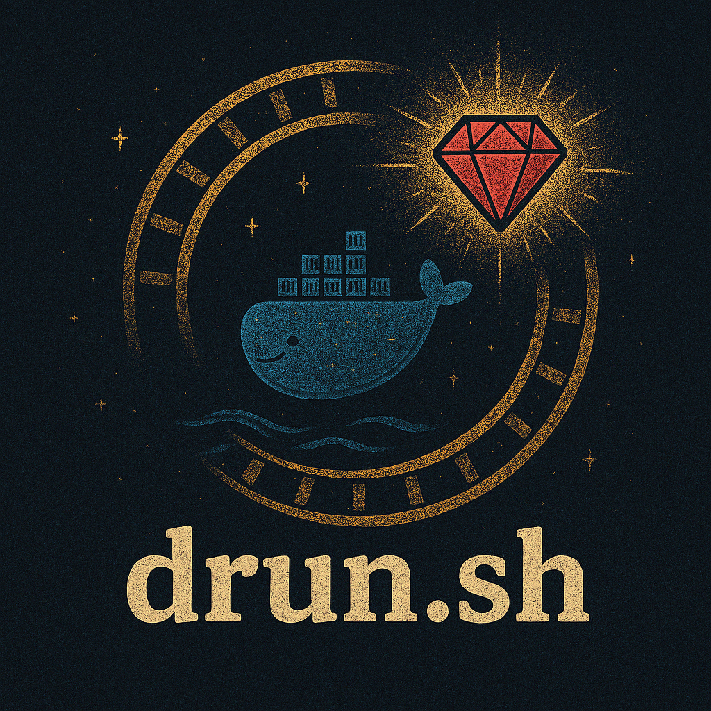

# drun.sh

`drun` is a powerful Docker/Podman container management tool for Ruby on Rails development. It provides a streamlined workflow for managing Rails applications in containers, with built-in support for PostgreSQL, Redis, and other essential services.

<p align="center">
  
</p>

## 📚 Documentation

- [Getting Started](GETTING_STARTED.md) - Quick setup and common commands

## 🚀 Quick Start

1. Install the container management script:
   ```bash
   curl -o drun.sh https://raw.githubusercontent.com/Rynaro/drun/main/drun.sh && chmod +x drun.sh
   ```

2. Create a new Rails application:
   ```bash
   ./drun.sh rails new .
   ```

3. Start your development environment:
   ```bash
   ./drun.sh serve
   ```

4. Visit http://localhost:3000 in your browser

## 🎀 Common Commands

### Container Management
| Command | Description |
|---------|-------------|
| `./drun.sh build` | Build containers |
| `./drun.sh serve` | Start the application |
| `./drun.sh down` | Stop containers |
| `./drun.sh restart` | Restart containers |
| `./drun.sh ps` | Show container status |
| `./drun.sh logs [service]` | View container logs |

### Rails Commands
| Command | Description |
|---------|-------------|
| `./drun.sh console` | Open Rails console |
| `./drun.sh shell` | Open a shell in the Rails container |
| `./drun.sh rails <cmd>` | Run any Rails command |
| `./drun.sh rake <task>` | Run any Rake task |
| `./drun.sh bundle <cmd>` | Run any Bundler command |
| `./drun.sh test` | Run Rails tests |
| `./drun.sh rspec` | Run RSpec tests |

### Cleanup Commands
| Command | Description |
|---------|-------------|
| `./drun.sh clean` | Clean project containers, volumes, and networks |
| `./drun.sh clean-all` | Clean all project resources including images |

### Other Commands
| Command | Description |
|---------|-------------|
| `./drun.sh help` | List all available commands |
| `./drun.sh thanks` | Show appreciation message |

## 📦 Technical Details

`drun` provides a complete development environment:

- Ruby 3.4
- Latest Rails
- PostgreSQL 17.5 database
- Redis 8 for caching and background jobs
- Works with both Docker and Podman
- Secure by default (non-root user, proper healthchecks)
- Optimized container builds with multi-stage builds
- Persistent volume management for data and caches
- Project-specific resource management
- Automatic container health monitoring

## 🔒 Security Features

- Runs as non-root user (`drunner`)
- Proper healthchecks for all services
- Secure PostgreSQL configuration with SCRAM-SHA-256
- Redis password protection
- Environment variable based configuration
- Volume isolation for sensitive data
- Project-specific resource labeling
- Automatic container health monitoring

## 📄 License

This project is licensed under the [MIT License](LICENSE).

## 🙏 Acknowledgments

This project has been influenced by [Docked](https://github.com/rails/docked), a similar tool by the Rails team.
